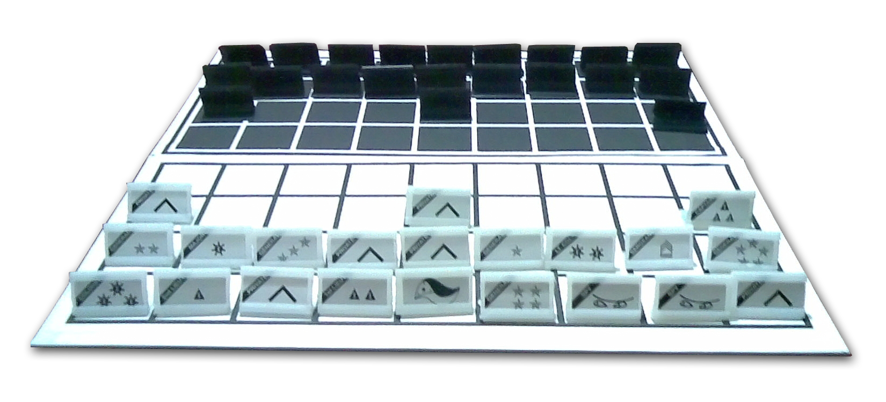

## Hobby Final Project — CMSC 22

Good day! 

This is a repacked board game called World at War(Blitz!) which takes inspiration from my favorite childhood
board game which is Salpakan or GotG.

The game utilizes all the first three row spaces which leads to more dynamic action all throughout a game instance.

It features:
- One extra 5-Star General
- Two extra Agents(Spies)
- Three extra Privates

I do not claim ownership for the entire code as I have spent a lot of time in resourcing and converting codes from old
modules, implementing them and improving their usage. 

The project is nowhere near being fully optimized and there are some features I have not found ways to implement yet.

More info on [Game of the Generals](http://www.geekyhobbies.com/game-of-the-generals-aka-salpakan-review-and-rules/).

# Resources and References Used:

## Major Resources:
  - [Some Indian's Chess Engine Code — VERY IMPORTANT](https://github.com/amir650/AxisWidow-Chess)
  - [Java Chess Engine Tutorial](https://www.youtube.com/watch?v=h8fSdSUKttk&list=PLOJzCFLZdG4zk5d-1_ah2B4kqZSeIlWtt)
  - [Java Tutorial - Creating a Minesweeper](https://www.youtube.com/watch?v=RFpJp62ZoY8&list=PLGxHvpw-PAk6QvPw0fYe8bks31GRKvymK)
  - [Game of the Generals Info](http://www.geekyhobbies.com/game-of-the-generals-aka-salpakan-review-and-rules/)
  - [Readme Picture](https://manigerz34.files.wordpress.com/2010/06/game_of_the_generals_board1.png)
## Debugging References:
  - [Reading Java Files](https://www.baeldung.com/reading-file-in-java)
  - [Accessing Resources](https://docs.oracle.com/javase/8/docs/technotes/guides/lang/resources.html)
  - [Preferences API](https://docs.oracle.com/javase/8/docs/technotes/guides/preferences/overview.html)
  - [Reading Java Files from src](https://mkyong.com/java/java-read-a-file-from-resources-folder/)
  - [Understanding Manifest Files](https://www.baeldung.com/java-jar-manifest#:~:text=The%20Manifest%20File,INF%20directory%20in%20the%20JAR.)
  - [List Files in a directory](https://stackabuse.com/java-list-files-in-a-directory/)
  - [JLayeredPane](https://docs.oracle.com/javase/7/docs/api/javax/swing/JLayeredPane.html#:~:text=JLayeredPane%20adds%20depth%20to%20a,on%20top%22%20of%20other%20components.)
  - [How to add mouse events](https://docs.oracle.com/javase/tutorial/uiswing/events/mouselistener.html)
  - ++ a lot more that I forgot to copy links because of rushing
